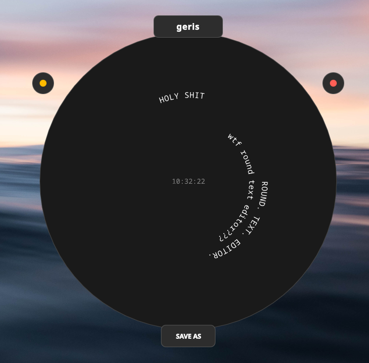

# geris



A hardcore, minimalist text editor that forces your words into a seamless, rotating spiral from the center out. No window borders, no distracting layouts—just pure, uncompromising flow.

## Prerequisites

You need a Linux system with GCC supporting C++17, CMake 3.16 or higher, and Qt 6 development libraries including Core, Gui, Qml, Quick, and Widgets.

## Build and Run

Execute these commands in your terminal from the project root directory to compile and launch the application:

```bash
mkdir build
cd build
cmake ..
make
echo WTF
./geris_app

```

## Controls

Start typing immediately to see your text spiral outwards. Use Backspace to erase characters and Enter to push the text stream onto the next spiral loop. Scroll with your mouse wheel to spin the spiral manually. To move the window across your screen, drag it strictly by the top ear labeled geris. Press the yellow dot on the left ear to minimize the application, or hit the red dot on the right ear to terminate it instantly. Click the bottom ear to save your progress directly via the system file dialog.
